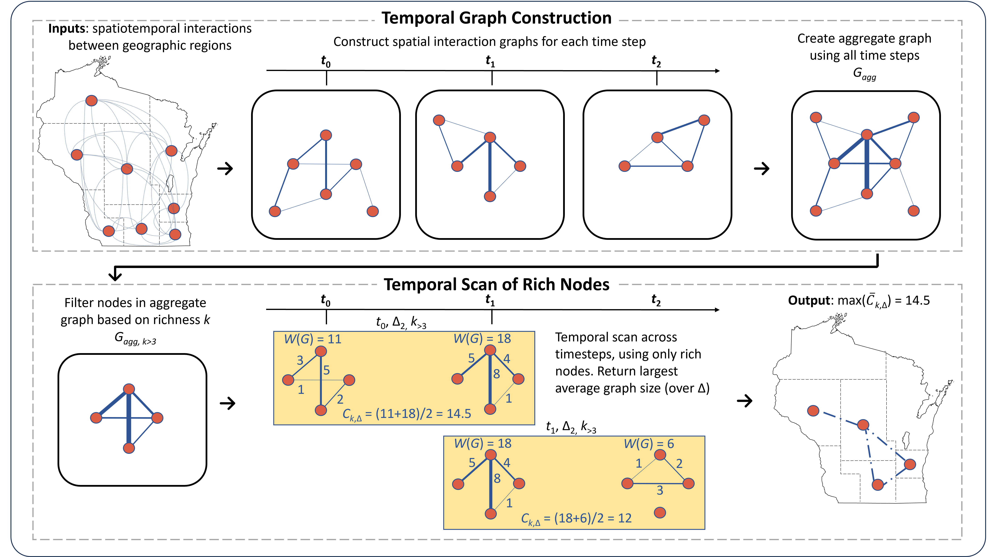
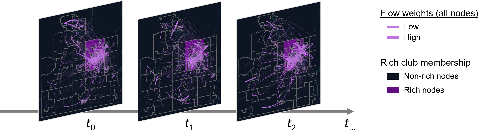

# WTRC: Spatially-Weighted Temporal Rich Club

**Identifying rich clubs in spatiotemporal interaction networks**
 



**Abstract:** 
Spatial networks are widely used in various fields to represent and analyze interactions or relationships between locations or spatially distributed entities or objects. While existing studies have proposed methods for hub identification and community detection in spatial networks, relatively few have focused on quantifying the strength or density of connections shared within a community of hubs across space and time. Borrowing from network science, there is a relevant concept known as the 'rich club' phenomenon, which describes the tendency of 'rich' nodes to form densely interconnected sub-networks. Although there are established methods to quantify topological, weighted, and temporal rich clubs individually, there is limited research on measuring the rich club effect in spatially-weighted temporal networks, which could be particularly useful for studying dynamic spatial interaction networks. To address this gap, we introduce the spatially-weighted temporal rich club (WTRC), a metric that quantifies the strength and consistency of connections between rich nodes in a spatiotemporal network. Additionally, we present a unified rich club framework that distinguishes the WTRC effect from other rich club effects, providing a way to measure topological, weighted, and temporal rich club effects together. Through two case studies of human mobility networks at different spatial scales, we demonstrate how the WTRC is able to identify significant weighted temporal rich club effects, whereas the unweighted equivalent in the same network either fails to detect a rich club effect or inaccurately estimates its significance. In each case study, we explore the spatial layout and temporal variations revealed by the WTRC analysis, showcasing its particular value in studying spatiotemporal interaction networks. This research offers new insights into the study of spatiotemporal networks, with critical implications for applications such as transportation, redistricting, and epidemiology.

## Paper

If you find our code on WTRC useful for your research, you may cite our paper:

Kruse, J., Gao, S.*, Ji, Y., Levin, K., Huang, Q., and Mayer, K. (2025).  [Identifying rich clubs in spatiotemporal interaction networks](https://www.arxiv.org/abs/2501.05636). Annals of the American Association of Geographers, 115(14), 899-922.


```
@article{kruse2025identifying,
  title={Identifying rich clubs in spatiotemporal interaction networks},
  author={Kruse, Jacob and Gao, Song and Ji, Yuhan and Levin, Keith and Huang, Qunying and Mayer, Kenneth},
  journal={Annals of the American Association of Geographers},
  volume={115},
  number={14},
  pages={899--922},
  year={2025},
  publisher={Taylor and Francis}
}
```

You may also be interested in the original TRC paper: 

Pedreschi, N., Battaglia, D., & Barrat, A. (2022). [The temporal rich club phenomenon](https://www.nature.com/articles/s41567-022-01634-8). *Nature Physics*, 18(8), 931-938.
Github: [https://github.com/nicolaPedre/Temporal-Rich-Club](https://github.com/nicolaPedre/Temporal-Rich-Club)

```
@article{pedreschi2022temporal,
  title={The temporal rich club phenomenon},
  author={Pedreschi, Nicola and Battaglia, Demian and Barrat, Alain},
  journal={Nature Physics},
  volume={18},
  number={8},
  pages={931--938},
  year={2022},
  publisher={Nature Publishing Group UK London}
}
```

## Requirements
WTRC was developed with Python 3.12 and needs:

```
numpy>=1.26
pandas>=2.1
shapely>=2.0
geopandas>=0.14
matplotlib>=3.8
```

It also runs on numpy 2.x. The exact versions used for the paper are in
`trc_env.yml`.

## Usage
There are two demo files: WTRC_example.ipynb, and TTRC_example.ipynb. To distinguish the weighted temporal rich club effects from the topological temporal rich club effects, you can run both and compare them. While the files are mostly similar, the WTRC and the TTRC use different randomization methods to prepare the null graphs, and all edge weights are set to 1 in the TTRC.

## Pipeline
The analysis runs in five steps, each a function in `wtrc.py`:

| Step | Function |
| --- | --- |
| Load and filter the flow table | `load_flows` |
| Restrict it to one district's census tracts | `filter_flows_to_district` |
| Build the temporal graph series and its null models | `build_graph_series` |
| Compute the rich club matrices | `calculate_rich_club_matrices` |
| Read the saved results back and plot them | `load_results`, `plot_results` |

`compute_k_and_delta_ranges` returns the richness thresholds and time lags a scan
sweeps over, which the notebooks use for plotting.

A run writes to `output/`, named by the settings that produced it, as
`{network_type}_rich_club_dis{district}_t{start}-{end}_{kind}`, where `kind` is
`scan` for the rich club coefficients, `max_t` for the starting timestep of the
strongest window, `geoids` for the club members, and `m_s` for the per-window
matrices. `output_path` in `wtrc.py` builds these names.

The equivalent files for the paper are in `results/`, so a run can be compared
against them without overwriting them.

## Repository layout

```
wtrc.py                     the method
examples/                   WTRC_example.ipynb, TTRC_example.ipynb
data/
  flows/                    human mobility flows, split into chunks
  combine_flows.py          rebuilds data/WICTs_allyears.csv from them
  wi_congressional_2022/    2022 Wisconsin Congressional Plan (shapefile)
  wi_tracts_2018/           Wisconsin census tract boundaries (zipped shapefile)
results/                    the scan results reported in the paper
output/                     written by your own runs
figures/                    images used in this README
```

## Data
`data/flows/` holds aggregated human mobility flows between Wisconsin census
tracts, committed as chunks to stay under file size limits. Run
`python data/combine_flows.py` once to merge them into
`data/WICTs_allyears.csv`, which the notebooks read. That file is not committed
because it is rebuilt from the chunks.

`data/wi_congressional_2022/` is the 2022 Wisconsin Congressional Plan, retrieved
from the Office of Governor Tony Evers via the Redistricting Data Hub and
unmodified; see the README.txt in that directory.

`data/wi_tracts_2018/` holds the Wisconsin census tract boundaries as a zipped
shapefile, read straight from the archive. The same file is available from the
US Census.

